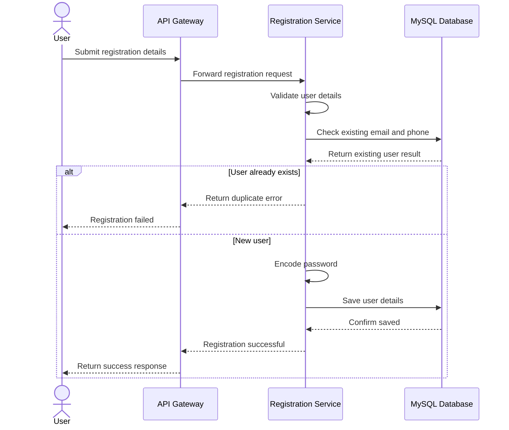

# Registration Sequence Diagram

```mermaid
sequenceDiagram
    actor User
    participant Gateway as API Gateway
    participant Registration as Registration Service
    participant DB as MySQL Database

    User->>Gateway: Submit registration details
    Gateway->>Registration: Forward registration request
    Registration->>Registration: Validate user details
    Registration->>DB: Check existing email and phone
    DB-->>Registration: Return existing user result

    alt User already exists
        Registration-->>Gateway: Return duplicate error
        Gateway-->>User: Registration failed
    else New user
        Registration->>Registration: Encode password
        Registration->>DB: Save user details
        DB-->>Registration: Confirm saved
        Registration-->>Gateway: Registration successful
        Gateway-->>User: Return success response
    end
```
